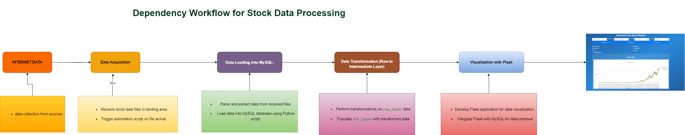
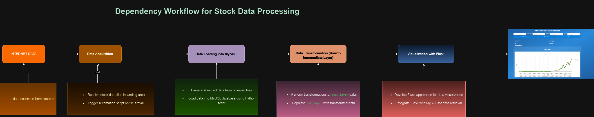
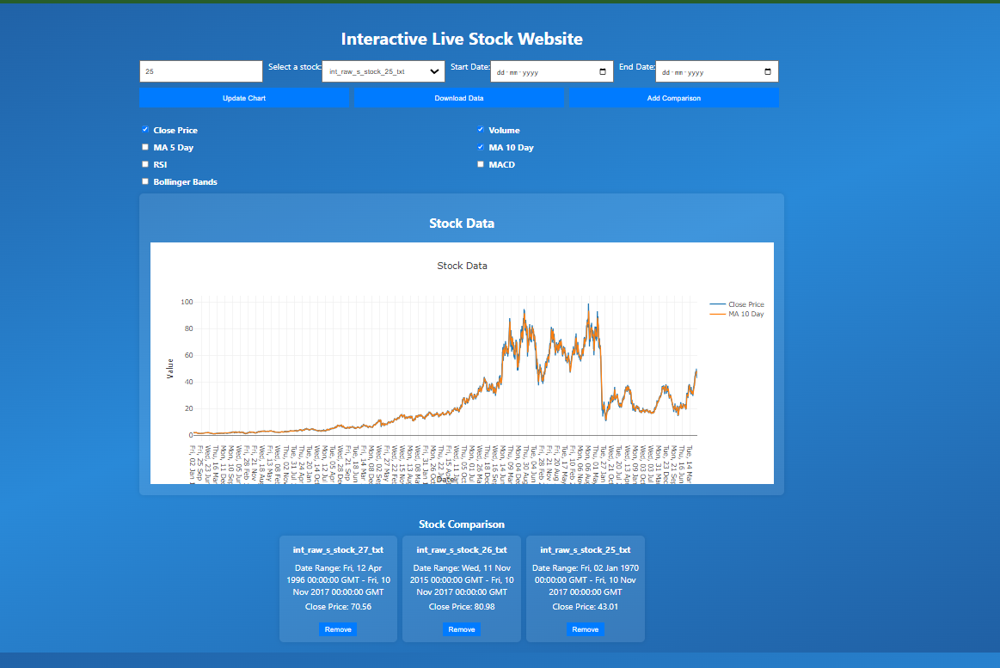

# Stock Data Processing Workflow

This repository contains the complete workflow for handling stock data, from initial acquisition to final visualization. This README will guide you through setting up the project, understanding the workflow, and using the provided scripts.

## Table of Contents
1. [Introduction](#introduction)
2. [Workflow Overview](#workflow-overview)
3. [Setup Instructions](#setup-instructions)
4. [Data Acquisition](#data-acquisition)
5. [Data Loading into MySQL](#data-loading-into-mysql)
6. [Data Transformation](#data-transformation)
7. [Visualization with Flask](#visualization-with-flask)
8. [Designing the Web Interface](#designing-the-web-interface)
9. [Example Use Case](#example-use-case)
10. [Challenges and Solutions](#challenges-and-solutions)
11. [Future Enhancements](#future-enhancements)
12. [Contributing](#contributing)

## Introduction

The goal of this project is to provide a robust and efficient workflow for processing stock data. This involves acquiring the data, loading it into a database, transforming it, and visualizing it through a web interface.

## Workflow Overview


<!--  -->
1. **Data Acquisition:** Setting up a landing area and using a Python script to automate data ingestion.
2. **Data Loading into MySQL:** Parsing files, ensuring data integrity, and storing them in MySQL.
3. **Data Transformation:** Using ETL processes to transform raw data into an intermediate layer.
4. **Visualization with Flask:** Creating a web application to visualize and interact with the transformed data.
5. **Designing the Web Interface:** Building a responsive and interactive web page for data exploration.

## Setup Instructions

1. **Clone the Repository:**
   ```bash
   git clone git@github.com:yogeshmapari/Stock_Data_Processing.git
   cd Stock_Data_Processing
2. **Create a Virtual Environment and Install Dependencies:**

   ```bash
   python3 -m venv venv
   source venv/bin/activate
   pip install -r requirements.txt
3. **Set Up MySQL Database:**

   Install MySQL and create a database for the project.
   Update the database configuration in config.py.
   Run the Data Acquisition Script:
   run below sql code in mysql for all basic database creations

   [MYSQL PRE QUERIES](must_run_queries.sql.txt)


   ```bash
   python data_acquisition.py
4. **Run the Data Loading Script:**
    ```bash
   python file_based_trigger.py
5. **Run the Data Transformation Script:**

    ```bash
   python modify_tables_tranformatin.py
6. **Run the Flask Application:**

    ```bash
   flask run
7. **open url in local browser:**

    <!-- ```bash -->
   http://127.0.0.1:5000
## Data Acquisition

### Landing Area Setup:
Establish a dedicated area for incoming stock data files. we called it as landing area.
folder name= landing_area

### Automation Script:
A Python script monitors this area for new files and triggers the data loading process.
we have [file_based_trigger.py ](file_based_trigger.py) file that will check the folder if any new files are their it will load them in mysql raw layer as table.

## Data Loading into MySQL

### Python Script for Loading:
Processes incoming files and loads them into MySQL.
we have design the python file i.e [raw_load.py ](raw_load.py) for the loading file data to mysql.

### File Parsing and Data Integrity:
Ensures data is correctly parsed and validated before insertion.
### Archival Area Setup:
we will move files to archival area once we are done with the data loading. may or may nor due to some issue we got data corrption we will load the file again by accessing it from archival area. 

folder name= archive_area

## Data Transformation

### Python Script for Transformation:
Transforms raw data into an intermediate layer.
i.e we are doing some calculation on base data we recived as 

New colunms added are ----> Daily_Return,  MA_5_Day, MA_10_Day, Volatility, RSI, MACD, Signal_9, Upper_Band, Lower_Band, Gain, Loss, AvgGain, AvgLoss, EMA_12, EMA_26, MA_20, SD_20

### ETL Process:
Extracts, transforms, and loads data to prepare it for analysis.

## Visualization with Flask

### Introduction to Flask:
A lightweight framework for building web applications.

### Integration with MySQL:
Retrieves transformed data and renders it dynamically using Jinja templates.
we get the data for all the stock and will make them avilable on webpage for analysis.

## Designing the Web Interface

### Web Page Creation:
Features interactive charts and tables for data exploration.

### User Interaction:
Responsive design ensures accessibility across devices.


## Challenges and Solutions

### Challenges:
- Data variability
- Performance
- Integration

### Solutions:
- Data quality checks
- Optimization techniques
- Continuous improvement

## Future Enhancements
- we will try to impliment live batch processing on local device
- we will try to my scraping for the stock data from internet.
- will add airflow based batch processing.

### Advanced Analytics:
Incorporate machine learning for predictive analysis.

### Real-Time Processing:
Enable real-time data streaming and analysis.

### User Feedback:
Iterate based on user interaction and requirements.


### CONTRIBUTION:
### Yogesh Mapari  patilmapari@gmail.com